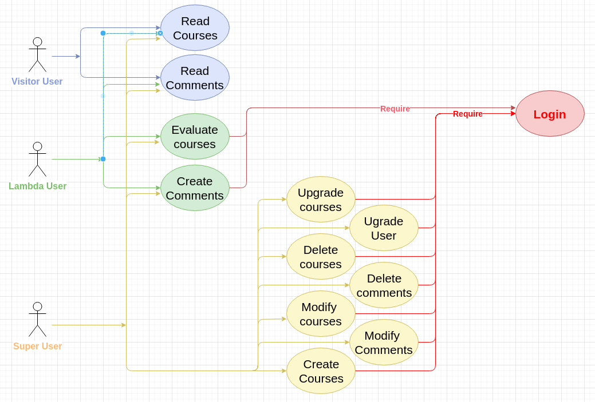
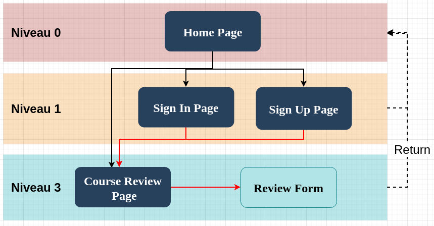

this project is part of our course at simplon school
# Impact Mapping
In this pre-project part, we specified all the requirements to define our project.

### project Global purpose :
Creation of an course website (M.O.O.C)
Users will connect to our website and will be able to find a list of MOOCs inside. 
They will be able to view the details of a course, see the comments that will be attached to it and can also add their own.

### file architecture :

In this folder you will find all the framing resources like diagrams and specs :

    ├── Framing
       ├── Activity-diagrams
       │   ├── authentification_module.drawio
       │   └── global.drawio
       ├── Class_diagram.drawio
       ├── Sequences-diagrams
       │   ├── Authentification.drawio
       │   ├── Comments.drawio
       │   └── courses.drawio
       ├── topologie_cloud.drawio
       └── use_case_diagram.drawio
  
  
### User Profiles :
- "Viewers" not logged in will be able to read courses and comments.
 - "lambda" users will be able to add comments and rate the courses.
 -  "super-users" will be able to promote users, delete comments, and add, update and delete an existing course.

#

#
# Tree Structure

#

